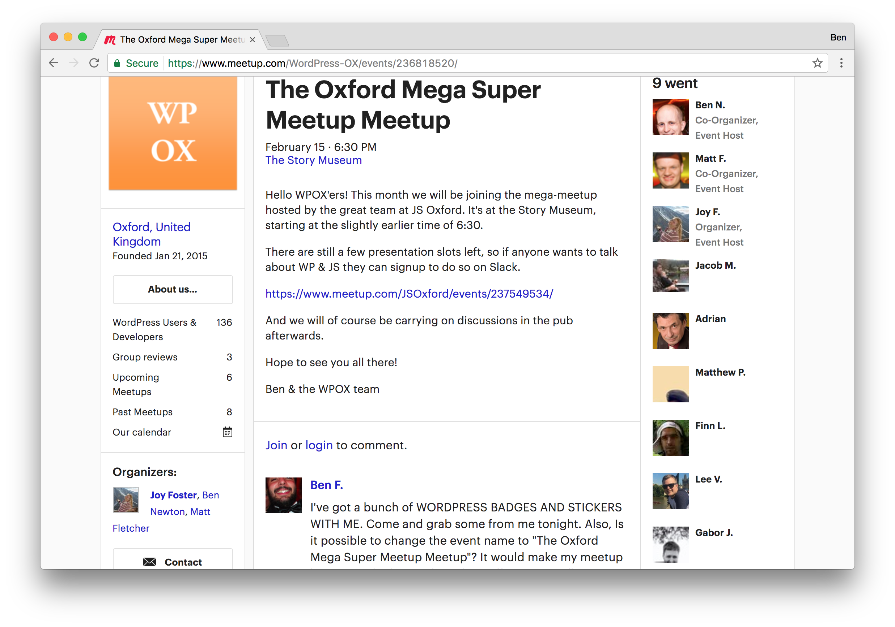

## (sketch slides)

---

# Hello

---

# Thanks

---

# I'm Ben

---

# Ben Foxall
# benjaminbenben.com
# @benjaminbenben
# github/benfoxall

---

# Ben Foxall (builds stuff)
# benjaminbenben.com
# @benjaminbenben
# github/benfoxall

---

# **Ben** Foxall (builds stuff)
# **ben**jamin**benben**.com
# @**ben**jamin**benben**
# github/**benfoxall**

---

# Oxford

---

# Oxford, UK

---

---

---

---

# Meetups

---

# Mega Meetups

---

# Super Mega Meetups

---

---

---

# ~

---

# What I'm going to talk about today:

---

# What I'm going to talk about today:

# [fit] Things*

---

## [fit] *_The Internet of Things_

## [fit] Connecting things together
## [fit] How to design things
## [fit] Making use of things
## [fit] How to build useful things
