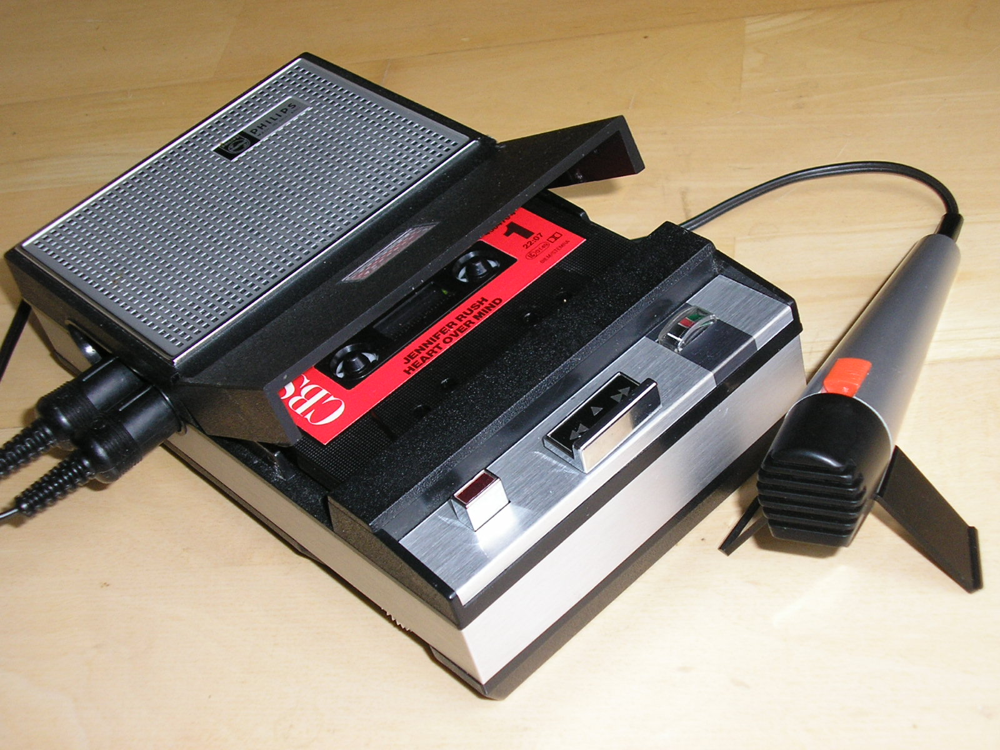
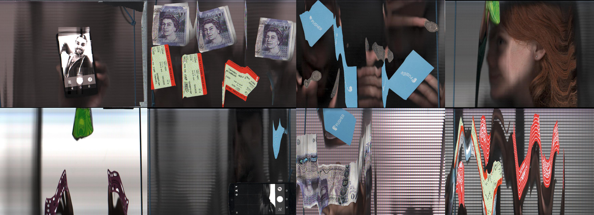
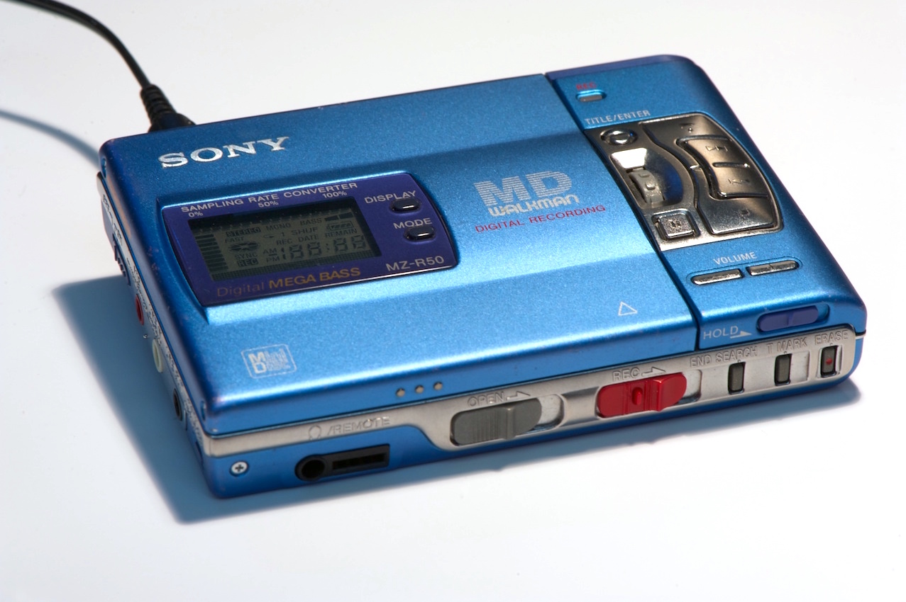
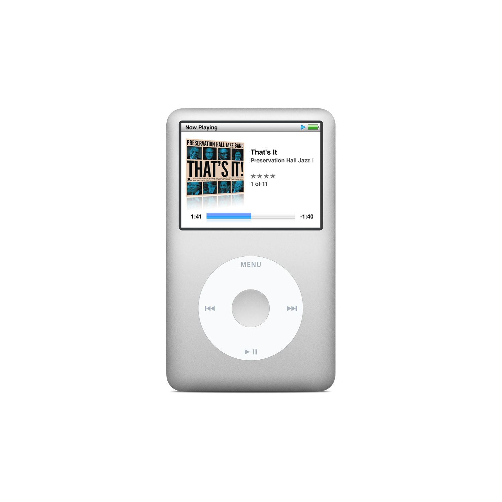
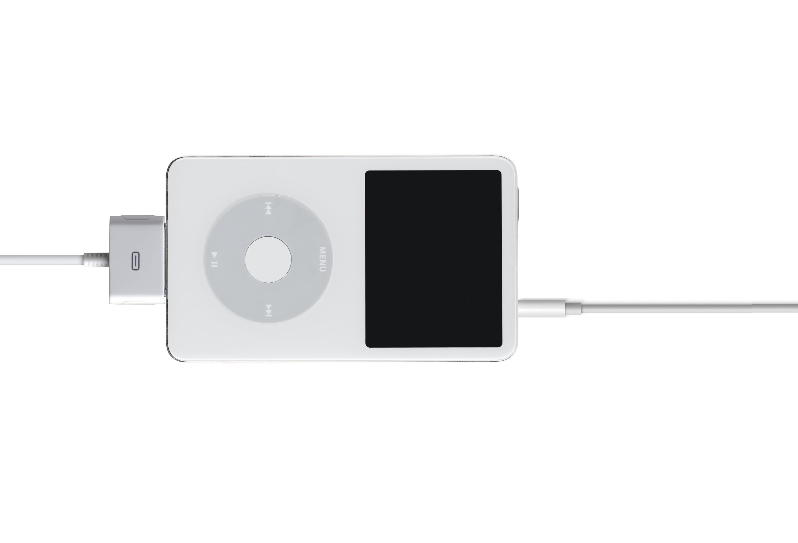

^ So, I'm here to talk quickly about simple things. It's a bit of a hard topic to talk about, because I feel like I have to be really succinct about everything or else I'll be a hypocrite.  But anyway - I'll give it a bit of try.

---

# [fit] I'm @benjaminbenben

^ Hello! I'm Ben.
* I live in Oxford

---

# [fit] I work at @Pusher

^ I work at Pusher
* Make it easy to put realtime data in your sites or apps
* You will have heard about it earlier today
* Is anyone using pusher for their hacks?

---

# [fit] and also other stuff

^
* js oxford
* render
* other stuff

---

# ~

^ Usually I give interactive talks, though this one is a bit more straightforward, though it's about something

---

# What is simple thing

^ So, I'm here to talk about simple things - lets think about what a simple thing is, like, literally.

---

# Simple

> Easily understood or done; presenting no difficulty

^ First of all, what is simplicity.  It's something that is easy to understand or do

---

# Thing

> An object that one need not, cannot, or does not wish to give a specific name to.

>  "Look at that metal rail thing over there"

^ "look at that metal rail thing over there"
^ There's a vageness to this - a casual

---

# Some properties of a simple thing

^ So, let's think of an example simple thing, and go from there.

---

^ This is the Compact Cassette, or Musicassette (MC)
* The name _doesn't really_ matter.
* It's definitely an _Object_
* It's got a very understandable use; it stores music

---

# 1. Understanding

^ First of all, something isn't simple just on it's own - it relies on someone being able to understand it.  You need to know the context of what someone is using them the thing is.

^ Simplicty is subjetive

^ First of all, for something to be simple, it has to be understood by someone.  If that person is you.

---

^ This is my friend Jake, we were at a conference and he had "broken" his cassette tape and didn't know how to fix it.  It was the first time that I realised that the tape wasn't a basic idea anymore - you had to be there.

^ Equally, in the 50s - people would have thought the idea of a tape so small was crazy.

^ For something to be simple, it needs to be understood, for something to be understood it needs to be in the hands of someone else.

---

## Simplicty requires Empathy

^ When you're making something, understand how someone is going to interact with it.  Put yourself in their shoes.

^ This doesn't mean that you can't innovate - if you can understand where someone comes from, then you can understand how they might be able to

^ At best they won't understand it.

---

# 2. Composability

^ If something is simple, then there's a good chance it could be *repurposed* for something else.

---

^ This is the Cassette tape being used for a completely different thing - loading a program into a ZX Spectrum. This wasn't designed to be this way, though it works because the concept was simple and generic enougg about

---

^ If something is simple, it can be repurposed.

^ Extension doesn't even have to use the object you've created - but can use the thing it connects to

---

## Composability requires openness

^ If you're abel to make something that's easy to understand, then you're more likely to see people doing different things with it.

---

# 3. Improvement

<!--
dates:

1963 - introduction (+ initial mono players)
1968 - portable players
1979 - walkman
-->

^ Once you've got a solid concept of what your _thing_ is, then the stuff around it can be improved.

---

<!-- EL 3302  By mib18 at German Wikipedia - Own work, CC BY-SA 3.0 -->

^ The first tape players came out around 1963. I really like the look of this one, it's got a really analogue-y look to it.

<!-- ---

 -->

---

^ TODO

<!-- ---

^ TODO -->

---

## Improvement requires standards

^ One of the reasons that this could be improved upon was that it had a strong standard - the shape of the tape didn't change over time.

---

# 4. Useful

---

^ All music wasn't created in the

---

## Usefulness requires constraint

---

# ~

---

# Some simple things

* The button
* Publishing Rooms

^ now we're going to go over some things that I have worked on that have been simple, and what came out of them.

---

^ First up, we have the button.  The reason we put this together was to create a simple way for things people to understand what we do. We could say to people "we're a scalable hosted websocket service", or "I press this button and the webpage updates"

---

^ While we were building the button, we realised it wasn't too much work to give anyone access to the button so that they could create their own integrations with it.

---

---

---

---

---

---

---

---

---

---

---

---

---

… some stuff about that

---

# Publishing Rooms

---

---

---

---

---

---

---

---

---

---

---

## Simple things are generative

---

## ~

---

# How to make simple things

---

---

# MiniDisc

^ I'm all about the future - so I got on board the next big thing… MiniDisc.  I swapped them with friends - I even bought pre-mastered minidiscs (californication by red hot chilli peppers)

---

^ Sony did the coolest minidisc players - I bought this one around 2001.

---

^ A few years later (2006), I wanted a new music player and since I had a bunch of minidiscs, I decided to upgrade my walkman.  I bought this new one.  It supported new formats LP2 & LP4, a new proprietary NetMD transfer (via sonic-stage).

^ It was a mess.  It had lost the simplicity that I first chose the MiniDisc for

^ Tiny side note.  Back in 2006, we used to think of headphone jacks as a good thing.

---

# ~~MiniDisc~~

^ It was time for me to abandon MiniDisc

---

# iPod

^ I'd been holding off on getting an iPod, I

^ My iPod was one of the favourite devices I ever owned.

---

---

^  I used to have an amp with phono plugs to 3.5mm jack.

---

# [fit] Power ➔ Thing ➔ Music

---

# an iPod is a _thing_

---

# iPods are simple

---

# [fit] Some things are less simple

---

---

## 1. Pretend it's a thing

---

* User stories
* Empathy
* 5 Whys - root cause analysis

---

## 2. Apps and Context

---

# Camera-Phones

---

# Multi-modal

---

# Multi-modal
# Multi-device

---

# UI should dissapear

---

---

---

---

---

---

---

---

---

# ~

#///

---

# (simple) things:

^ Today I'm going to talk quickly about simple things. It's a bit of a hard topic to talk about, because I feel like I have to be really succinct about everything or else I'll be a hypocrite.

---

# Compact Cassette

^ Cassette Tape - this is one of the

---

---

---

# MiniDisc

^ I'm all about the future - so I got on board the next big thing… MiniDisc.  I swapped them with friends - I even bought pre-mastered minidiscs (californication by red hot chilli peppers)

---

^ Sony did the coolest minidisc players - I bought this one around 2001.

---

^ A few years later (2006), I wanted a new music player and since I had a bunch of minidiscs, I decided to upgrade my walkman.  I bought this new one.  It supported new formats LP2 & LP4, a new proprietary NetMD transfer (via sonic-stage).

^ It was a mess.  It had lost the simplicity that I first chose the MiniDisc for

^ Tiny side note.  Back in 2006, we used to think of headphone jacks as a good thing.

---

# ~~MiniDisc~~

^ It was time for me to abandon MiniDisc

---

# iPod

^ I'd been holding off on getting an iPod, I

^ My iPod was one of the favourite devices I ever owned.

---

---

^  I used to have an amp with phono plugs to 3.5mm jack.

---

# [fit] Power ➔ Thing ➔ Music

---

# an iPod is a _thing_

---

# iPods are simple

---

# [fit] Some things are not simple things

---

---

# Apps & Context

---

^ When

---

---

<!--

---

# The Button

[picture of button]

---

# Why did we want a button

> "Pusher is a hosted realtime service which makes it easy to share backend events and data with your front-end users through our web and native front-end libraries."

---

# Why did we want a button

> "Pusher is a hosted realtime service which makes it easy to share backend events and data with your front-end users through our web and native front-end libraries."

> "Press this button and see that light go on"

---

# Why it's good

---

> The more constraints one imposes, the more one frees one's self. And the arbitrariness of the constraint serves only to obtain precision of execution.
-->
