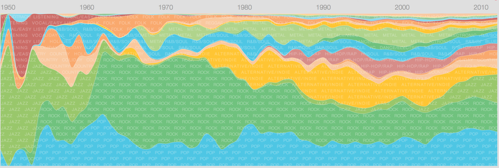

build-lists: true

# Simpler Things

---

^ So, I'm here to talk quickly about simple things. It's a bit of a hard topic to talk about, because I feel like I have to be really succinct about everything or else I'll be a hypocrite.  But anyway - I'll give it a bit of try.

---

# [fit] I'm @benjaminbenben

^ Hello! I'm Ben.
* I live in Oxford

---

# [fit] I work at @Pusher

^ I work at Pusher
* Make it easy to put realtime data in your sites or apps
* You will have heard about it earlier today
* Is anyone using pusher for their hacks?

^ I also do other stuff
* js oxford
* summer of hacks
* render
* surfing

---

<!-- # I do other stuff -->

---

# ~

^ Usually I give interactive technical talks, though this is going to be a short "thought piece" or whatever. I've found it surprisingly hard to put together

---

# I think we should try to make __simple things__

^ this is what I'm here to say - and I think today at this hack day, it's particularly important.  It's always really tempting to get carried away with an idea

^ Last year I was at a hack day, and tried to build a car that would scan in it's environment with ultrasonic sensors.  By the end of the day I could get it to turn around…

---

## [fit] A Simple Thing

1. Easily described & understood
2. A self contained _object_
3. Open to purpose*

^ What is a simple thing?

^ What I mean by a simple thing:
* easily understood
* a contained _object_
* the purpose isn't clearly defined

^ simple - "Easily understood or done; presenting no difficulty"
^ thing - "An object that one need not, cannot, or does not wish to give a specific name to."

---

^ This is the Compact Cassette, or Musicassette (MC)
* The name _doesn't really_ matter.
* It's definitely an _Object_
* It's got a very understandable use; it stores music

---

<!-- 

--- -->

<!-- EL 3302  By mib18 at German Wikipedia - Own work, CC BY-SA 3.0 -->

^ Once you've got a solid concept of what your _thing_ is, then the stuff around it can be improved.

^ The first tape players came out around 1963. I really like the look of this one, it's got a really analogue-y look to it.

^ dates:
* 1963 - introduction (+ initial mono players)
* 1968 - portable players
* 1979 - walkman

<!--
---

-->

---

^ TODO

^ Compact Cassette players weren't locked into a particular way of looking

<!-- ---

> my freedom will be so much the greater and more meaningful the more narrowly I limit my field of action and the more I surround myself with obstacles. -->

<!-- Igor Stravinsky -->

^ Constraints are freedom

---

^ All music wasn't created in the

^  Improvement requires standards

^ One of the reasons that this could be improved upon was that it had a strong standard - the shape of the tape didn't change over time.

^ Usefulness requires constraint

<!-- ---

^ TODO -->

---

^ This is my friend Jake, we were at a conference and he had "broken" his cassette tape and didn't know how to fix it.  It was the first time that I realised that the tape wasn't a basic idea anymore - you had to be there.

^ Equally, in the 50s - people would have thought the idea of a tape so small was crazy.

^ For something to be simple, it needs to be understood, for something to be understood it needs to be in the hands of someone else.

^ First of all, something isn't simple just on it's own - it relies on someone being able to understand it.  You need to know the context of what someone is using them the thing is.

^ Simplicty is subjective

^ If you think something is simple, that doesn't mean that other people do

^ First of all, for something to be simple, it has to be understood by someone.  If that person is you.

^ Simplicty requires Empathy

^ When you're making something, understand how someone is going to interact with it.  Put yourself in their shoes.

^ This doesn't mean that you can't innovate - if you can understand where someone comes from, then you can understand how they might be able to

^ At best they won't understand it.

---

^ This is the Cassette tape being used for a completely different thing - loading a program into a ZX Spectrum. This wasn't designed to be this way, though it works because the concept was simple and generic enougg about

^ Composability

^ If something is simple, then there's a good chance it could be *repurposed* for something else.

---

^ If something is simple, it can be repurposed.

^ Extension doesn't even have to use the object you've created - but can use the thing it connects to

^ Composability requires openness

^ If you're able to make something that's easy to understand, then you're more likely to see people doing different things with it.

---

^ This is the minidisc - introduced
^ Simple things can inspire others

---

> We look at the present through a rear view mirror. We march backwards into the future.

Marshall McLuhan

---

# ~

---

# Some simple things

* A button
* A scanner

^ now we're going to go over some things that I have worked on that have been simple, and what came out of them.

---

# A button

---

^ First up, we have the button.  The reason we put this together was to create a simple way for things people to understand what we do. We could say to people "we're a scalable hosted websocket service", or "I press this button and the webpage updates"

---

^ While we were building the button, we realised it wasn't too much work to give anyone access to the button so that they could create their own integrations with it.

---

---

---

---

^ Another thing we see a lot it morse code

---

---

---

<!-- ---

---

 -->

---

^ This one is interesting.

^ Inspired by Martin Pistorius, who suffered from Locked in Syndrome. For 13 years he was trapped in his own body.

^ Interesting because it's being used for a completely different purpose from what we thought possible.

^ Something actually meaningful with it

---

^ We got a tweet from Martin about the hack

^ I think this is the best feedback I can imagine for Pusher. To know that the thing we created has meaning

---

# ~

^ Something that's interesting about the button is that it's implementation has completely changed 3 times over - but it hasn't mattered at all because the interface/object has stayed the same.

<!-- ---

… some stuff about that -->

---

# A scanner

---

^ This is a simple object

---

^ We got 40 scanners & plugged them into Pi

---

---

---

---

---

---

---

---

## ~

---

# Simple things

---

## Keep it simple, stupid

^ coined by Kelly Johnson
^ Locheed Skunkworks - Spyplanes
^ Don't like this - down on people

---

## Keep it simple stupid

^ Kelly never used the comma
^ design things for stupid tools

---

### Simplicity needs empathy

---

### Implementation doesn't matter if you've got a thing

---

^ we went through 3 backends

---

### Build things that are open to purpose

---

# Thanks

## @benjaminbenben
## @pusher

### pusher.com
### button.pusher.io
### publishingrooms.com
