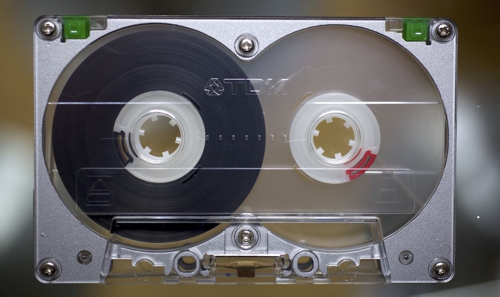
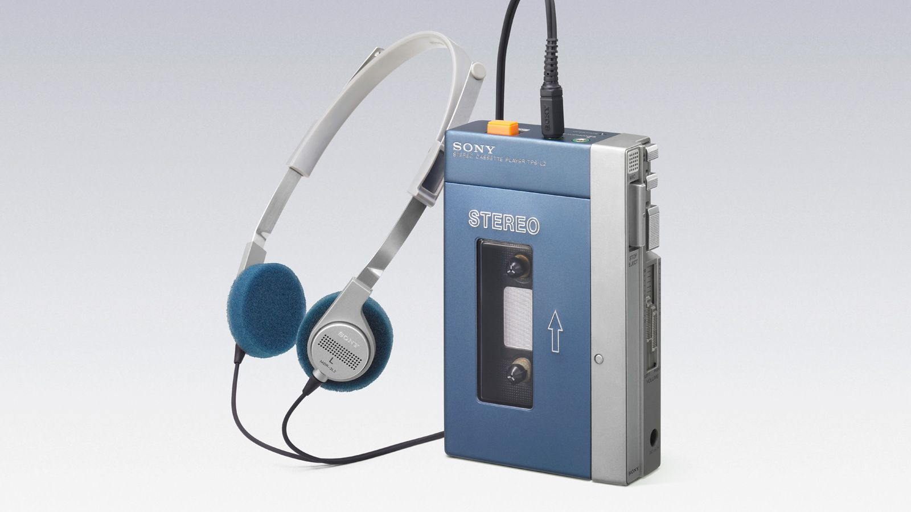
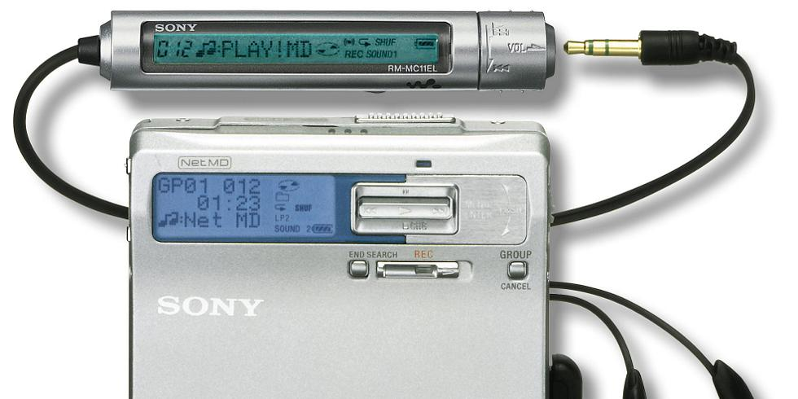
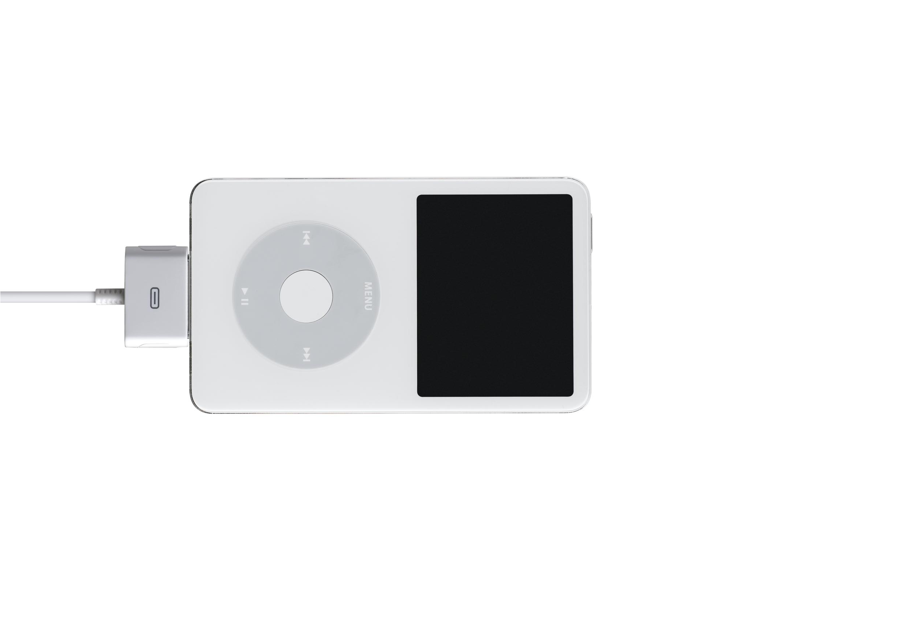
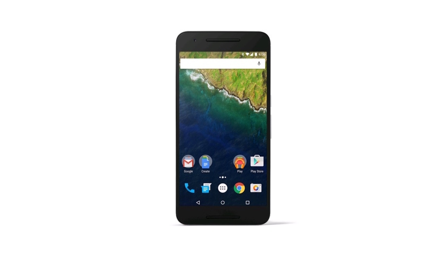
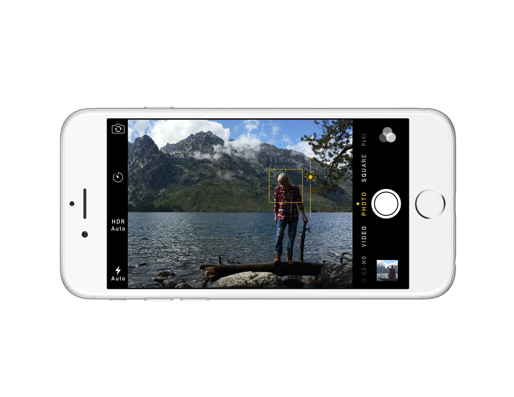

---

# [fit] I'm @benjaminbenben

^ Hello! I'm Ben.
* js oxford
* render
* other stuff

---

# [fit] I work at @Pusher

^ I work at Pusher
* Make it easy to put realtime data in your sites or apps
* You will have heard about it earlier today
* Is anyone using pusher for their hacks?

---

# (simple) things:

^ Today I'm going to talk quickly about simple things. It's a bit of a hard topic to talk about, because I feel like I have to be really succinct about everything or else I'll be a hypocrite.

---

# Compact Cassette

^ Cassette Tape - this is one of the

---

---

---

# MiniDisc

^ I'm all about the future - so I got on board the next big thing… MiniDisc.  I swapped them with friends - I even bought pre-mastered minidiscs (californication by red hot chilli peppers)

---

^ Sony did the coolest minidisc players - I bought this one around 2001.

---

^ A few years later (2006), I wanted a new music player and since I had a bunch of minidiscs, I decided to upgrade my walkman.  I bought this new one.  It supported new formats LP2 & LP4, a new proprietary NetMD transfer (via sonic-stage).

^ It was a mess.  It had lost the simplicity that I first chose the MiniDisc for

^ Tiny side note.  Back in 2006, we used to think of headphone jacks as a good thing.

---

# ~~MiniDisc~~

^ It was time for me to abandon MiniDisc

---

# iPod

^ I'd been holding off on getting an iPod, I

^ My iPod was one of the favourite devices I ever owned.

---

---

^  I used to have an amp with phono plugs to 3.5mm jack.

---

# [fit] Power ➔ Thing ➔ Music

---

# an iPod is a _thing_

---

# iPods are simple

---

# [fit] Some things are not simple things

---

---

# Apps & Context

---

^ When

---

---

<!--

---

# The Button

[picture of button]

---

# Why did we want a button

> "Pusher is a hosted realtime service which makes it easy to share backend events and data with your front-end users through our web and native front-end libraries."

---

# Why did we want a button

> "Pusher is a hosted realtime service which makes it easy to share backend events and data with your front-end users through our web and native front-end libraries."

> "Press this button and see that light go on"

---

# Why it's good

---

> The more constraints one imposes, the more one frees one's self. And the arbitrariness of the constraint serves only to obtain precision of execution.
-->
