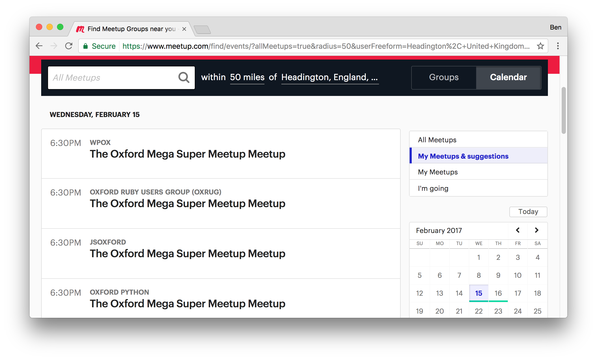
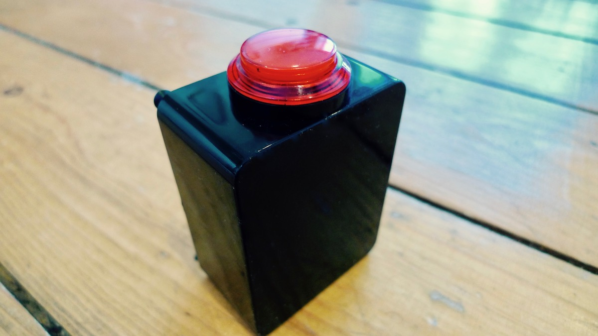
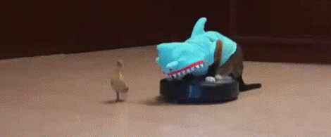
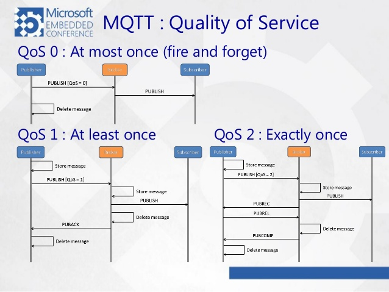
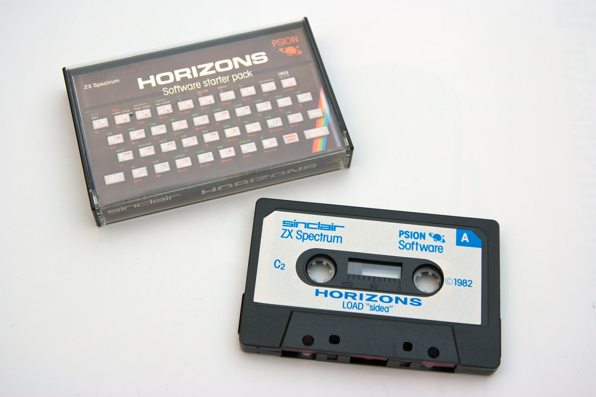
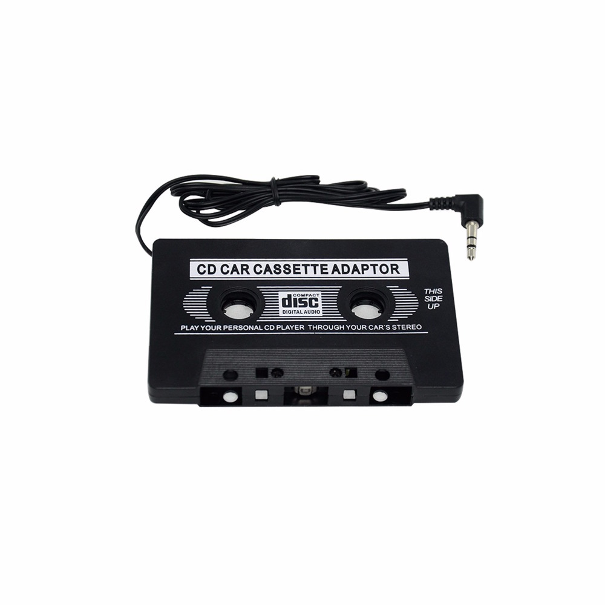

theme: Zurich, 2

# Hello

---

# Thanks

---

# I'm Ben

---


---


---


---

# Oxford

---


# Oxford, UK

---


---


---


---

# Meetups

---

# Mega Meetups

---

# Super Mega Meetups

---



---

[i feel like these are important - it's really valuable to learn about new perspectives]

[tech communities tend to be in little bubbles - you can gain a lot from getting a new perspective]

[new perspectives are as important]

---

# [fit] HTTP

---

# [fit] HTTP

## [fit] …isn't all that great

---

# [fit] HTTP

## [fit] …isn't all that great

### (sometimes)

---

# Reason 1.
# HTTP was designed for wires

^ HTTP assumes a good network

<!--
The idea of requesting a resource, then having to make subsequent RT to populate more information isn't a problem with our sites, it's a problem with our low level api.
GraphQL and h2 are ways of getting round this
-->

---

# Reason 2.
# HTTP resources need constant uptime
### even embedded & compute-constrained resources
<!--# HTTP wasn't designed for constrained devices
# Resources have the compute power-->

^ something that it only on for an hour a day, or maybe even a second a day

^ perhaps a good example, if we've got two resources

---

# ~

---

# What I'm going to talk about today:

---

# What I'm going to talk about today:

# [fit] Things

---

## [fit] _The Internet of Things_

## [fit] 1. Connecting things together
## [fit] 2. How to design things
## [fit] 3. Making use of things
## [fit] 4. How to build useful things

---

# ~

---

# 1
# [fit] Connecting things
# [fit] together

---

# Some example things

---

<!-- photo note, auto balance, transfer filter -->



---


# 1. a thing you can
# [fit] press down

---


---


# 2. some things that
# [fit] light up

---

# target outcome:

# When I press this thing, these things should turn red

---

<!-- curl 'https://benjaminbenben.com/led-strip' -H 'content-type: application/json' -H 'Accept: */*' -H 'Cache-Control: no-cache' --data-binary '{"color":"red"}'  -v -->

Sending a post request to our LED strip?

```
POST /led-strip HTTP/1.1
Host: benjaminbenben.com
User-Agent: curl/7.51.0
content-type: application/json
Accept: */*
Cache-Control: no-cache
Content-Length: 15

{"color":"red"}
```

<!-- content-type is the wrong capitalisation, edge case there -->

---

# Handling HTTP

* Opening ports
* Responding to requests
* Parsing request & headers
* Understanding
* Chunked encoding
* Persistent connections
* IP address changes

---

# JSON is pretty challenging too


---

# Small devices

* sketchy/variable network
* low processing power
* power consumption requirements

---

<!--# [fit] HTTP / JSON / REST-->

# [fit] We're going to need
# [fit] a smaller boat



---

# [fit] MQTT

---

# [fit] **MQ**TT

## Message Queue*

---

# [fit] MQ**TT**

## Telemetry Transport

---

* 1999 (with wireless in mind)
* lightweight
* publish subscribe topics
* message redelivery

---


---


---

# MQTT Broker

* Could be a satellite
* Could be a hub in a smart home
* Could be a box sitting in a field

---

## nope
# [fit] ~~REST~~
# [fit] ~~HTTP~~*

---

(MQTT over WebSockets)

---

# [fit] Publishing Messages

## eg. on button press

# publish '__/btn__' '__press__'

---


---


---


---


---

```php
fwrite($this->socket,  $message)
```

---

```
⨽⨽⨽⨽/btnpress
```

# vs

```
POST /btn HTTP/1.1
Host: benjaminbenben.com
User-Agent: curl/7.51.0
content-type: application/json
Accept: */*
Cache-Control: no-cache
Content-Length: 15

{"state":"pressed"}
```

---

# 13 bytes

# [fit] POST /btn HTT

---

# [fit] Receiving Messages

## eg. some lights

# Subscribe '**/led/color**'

---


---

## Subscribing to a topic

1. Set the message type to 1000 (subscribe)
2. Set payload to '/led/color'

<!--

## Message Types

```
1  CONNECT      Client request to connect to Server
2  CONNACK      Connect Acknowledgment
3  PUBLISH      Publish message
4  PUBACK       Publish Acknowledgment
5  PUBREC       Publish Received (assured delivery part 1)
6  PUBREL       Publish Release (assured delivery part 2)
7  PUBCOMP      Publish Complete (assured delivery part 3)
8  SUBSCRIBE    Client Subscribe request
9  SUBACK       Subscribe Acknowledgment
10 UNSUBSCRIBE  Client Unsubscribe request
11 UNSUBACK     Unsubscribe Acknowledgment
12 PINGREQ      PING Request
13 PINGRESP     PING Response
14 DISCONNECT   Client is Disconnecting
```

-->

---


## MQTT feature:

# [fit] QoS

## For when you're not sure if your satellite is even there

^ This is a feature that makes mqtt very different from http requests

---


---

# QoS 0
## Fire and Forget



---

# QoS 1
## "At most once delivery"
## Delivery confirmation


---

# QoS 2
## "Exactly once delivery"
## Client receive confirmation


---

## Resilient to flakey networks
## Retries embraced/expected

---

# [fit] MQTT
## …that's about it

### (connect, receipt messages, last will, persistence)

^ you sould prob

---

# Demo

---

# Connecting to wordpress things

---

## MQTT to REST bridge

---

## Webhook to MQTT

# ~

---

## [fit] 2. How to design things


## TODO


---

## [fit] 3. Making use of things

## TODO


---

## [fit] 4. How to build useful things

## TODO


---


# ~~~~


^ Exit - we've now considered wordpress as a "thing".

---

# [fit] Thinking about things

---

# A Thing
# Isn't what it's made from


---

# [fit] It's tempting to think that
## [fit] our job is about writing code

```php
print '<b>hello <i>world</B></i>';
```

<!---

# [fit] Our job is about
# [fit] creating stuff
# [fit] code is out tool for doing that
-->

---

<!-- # [UX & Wireframes] -->


<!--https://www.flickr.com/photos/benoitmeunier/6384895413 -->

---


---

# [fit] People use things
# [fit] to do stuff

---

# Question time:
## 1. What does your thing do?

---

# Question time:
## 1. What does your thing do?
## 2. Could it be doing that better?

^ _This_ is where it could be improved. It's not necessarily about adopting a new standard, or cleaning up code, it's about being purpose driven

---

# Sometimes we fix solutions instead of problems

---

# A Thing
# Is a point of interaction

<!--
Alternatives:
 * Is a concept
 * Has a cognitive model
 * Is a model
 * creates an interface
 * Is an interface
 * Is a cognitive interface
 * Is a point of interaction
-->

---


---


---


^ Phillips EL 3302 (this one)
^ Phillips EL 3300 - 1963 first ever tape player

---


^ 79 - 16 years later - Sony introduced the walkman

---



---



---

# A Thing

# Doesn't have to be simple


---


^ This is the cockpit of an SR-71, more commonly known as

---


^ …the blackbird

---

# [fit] The SR-71 avoided threats using

## [fit] 1/ altitude
## [fit] 2/ speed

---

# 80,000 feet


---


<!-- http://www.salimbeti.com/aviation/images/equip/sr71pilots70s.jpg-->

---

# Mach 3+


---

# "A thing that flies

# [fit] very high &
# [fit] very fast"

---


---


> For more information, watch __Skunk Works__ by __Nickolas Means__


---


# ~

---

> INTRO TO NEXT SECTION
> [PHOTO OF PHONE]
> HOW DO WE THINK OF THIS AS A THING


----


Photos:

* By USAF / Judson Brohmer - Armstrong Photo Gallery: Home - info - pic, Public Domain, https://commons.wikimedia.org/w/index.php?curid=30816
* By National Museum of the USAF, imagery by Lyle Jansma, Aerocapture Images - National Museum of the USAF website - linked on Cockpit360 images page (archived 2016-12-12), Public Domain, https://commons.wikimedia.org/w/index.php?curid=54004278
* By USAF/Brian Shul - Shul, Brian (1994). The Untouchables. Mach One. pp. 113–114. ISBN 0929823125., Public Domain, https://commons.wikimedia.org/w/index.php?curid=25099554

* By Frontier India Defense and Strategic News Service - http://album.frontierindia.net/main.php?g2_itemId=112, CC BY-SA 2.5 in, https://commons.wikimedia.org/w/index.php?curid=3492838
