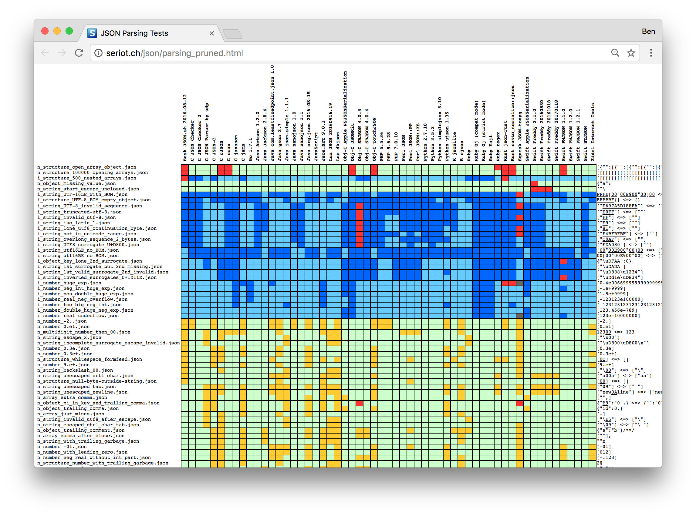
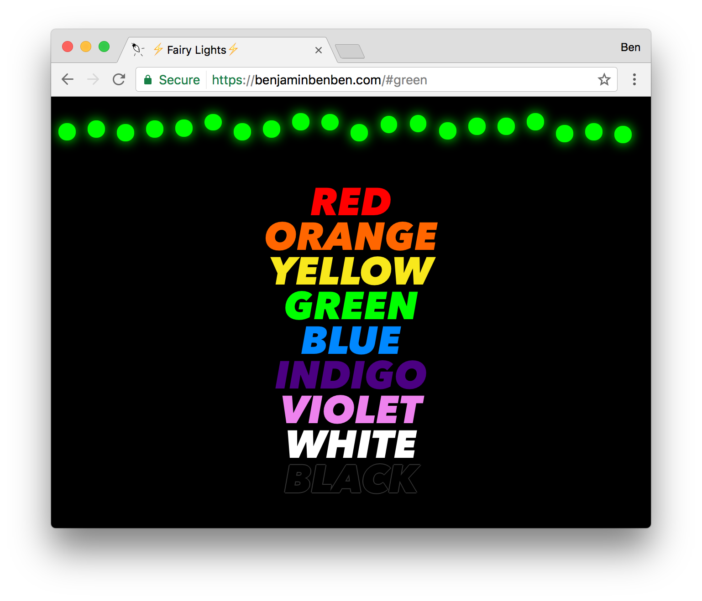

# [fit] Web Sites

# and

# [fit] Fairy Lights

---

# [fit] Hi, I'm Ben

## [fit] Freelance web developer & other stuff

### Say hi on twitter: @benjaminbenben

^
I'd usually say more things, but I don't have time today

---

# This is a talk about things:

---


---

# Some things that
# light up


---


---

# A thing you can
# [fit] press down


---

# These are:

* wireless
* battery powered

---

# This is a talk of 4 parts

---

# Part 1.
# [fit] Connecting **this Button** to these
# [fit] **Fairy Lights**

---


# Part 2.
# [fit] Connecting these Fairy Lights to a
# [fit] **Web Server**

---

# Part 3.
# [fit] Connecting these Fairy Lights to a
# [fit] **Web Browsers**

---

# Part 4.
# [fit] Is there anything
# [fit] **useful**
# [fit] about this?

^
There's a chance I won't have time to say this

---


---

# [fit] PART
# [fit] ONE
### Connecting this **Button** to these **Fairy Lights**

---

# target outcome:

# When I press this thing,
# these things should turn red

---

[button] [magical iot network] [fairy lights]

---

# [fit] HTTP?

---

```http
POST /fairy-lights HTTP/1.1
Host: benjaminbenben.com
User-Agent: curl/7.51.0
content-type: application/json
Accept: */*
Cache-Control: no-cache
Content-Length: 15

{"color":"red"}
```

---


# Handling HTTP

* Opening ports
* Parsing request & headers
* Responding to requests
* Handling http codes & response headers
* Persistent connections
* IP address changes

<!-- * push/broadcast challenges -->

<!--
https://en.wikipedia.org/wiki/List_of_HTTP_header_fields
https://en.wikipedia.org/wiki/List_of_HTTP_status_codes
-->

---

# (JSON is pretty challenging too)




---

<!-- MAYBE ADD - 3 ways HTTP sucks -->

# HTTP wasn't designed for IoT

^
* HTTP was designed for wires
* A resource requires permanent presence
* Impossible to have a response without a request

----

# [fit] ~~HTTP~~

^
So, we're not going to use http. What should we use instead? Any ideas?

---

# [fit] MQTT

---

# [fit] **MQ**TT

## Message Queue*

---

# [fit] MQ**TT**

## Telemetry Transport

^ The word Telemetry means to get information from somewhere and receive it somewhere else

---


^
MQTT was built with a use case in mind
Sensors on an oil pipeline wanting to transmit data through a satellite uplink
Satellites orbit the earth, so they might come in and out of contact and that's completely expected.

---


---

### publish subscribe
### topics
### messages


---

# MQTT Broker

* Could be a satellite
* Could be a hub in a home
* Could be a box sitting in a field

^
A broker could be many things:
A satellite
A central hub in a smart home
Sitting in a field

---

# MQTT Client

* Could be a phone
* Could be a button
* Could be some fairy lights

---

# MQTT Connection

* Stateful
* Message based
* Binary

^ you've got a persistent connection and you're sending binary messages back and forth along it.

---

# Message Types

## CONNECT, CONNACK, PUBLISH, PUBACK, PUBREC, PUBREL, PUBCOMP, SUBSCRIBE, SUBACK, UNSUBSCRIBE, UNSUBACK, PINGREQ, PINGRESP & DISCONNECT

---

# Example (publishing messages)

```
> CONNECT
< CONNACK
> PUBLISH /fairy-lights/12 red
```


---

# Example  (subscribing messages)

```
> CONNECT
< CONNACK
> SUBSCRIBE /fairy-lights/+
…
…
< PUBLISH /fairy-lights/12 red
…
…
< PUBLISH /fairy-lights/15 blue
…
```

---

# Features

### (vs HTTP)

* lightweight protocol
* configurable QoS

---

# QoS

* 0
* 1
* 2

^
HTTP is just passed 1 (you get confirmation, with payload)

---

# [fit] MQTT
## …that's about it

---

# [fit] MQTT
## …that's about it

### (though also; security/encryption, client IDs, last will, persistence, ping/pong)

---

# Demo

## Let's hook the button and lights together

---


---

# ✨

## We've connected a couple of
## things together

---


---

# [fit] PART
# [fit] TWO
### Connecting Fairy Lights to a **Web Server**

---

# target outcome:

# When I post to my blog, <br/>these things change colour

---


---

# For WordPress to be a **thing**:

## 1/ Subscribe to topics
## 2/ Publish messages

---

# 1/ Subscribe to topics

---

# 1/ Subscribe to topics

# Create an mqtt-wp bridge

### (A script that forwards on messages)

### [github/benfoxall/mqtt-wp](https://github.com/benfoxall/mqtt-wp)

---

```js
const WPAPI = require('wpapi')

const wp = new WPAPI(config.wp)

const update = (slug, content) =>
  wp.pages().slug(slug)
    .update({content})

// update('my-thing', 'Sensor value: 4')
```

---

```js
const mqtt = require('mqtt')

const client = mqtt.connect(config.mqtt_host)

client.subscribe('my/sensor')

client.on('message', (topic, buffer) => {
  const content = escape(buffer.toString())
  update('my-sensor', content)
})

```

---

# 2/ Publish messages

---

# 2/ Publish messages

# WP-MQTT

---

## WP-MQTT settings


---


---

# Demo

## Let's bring WordPress onto our MQTT network

---

---

# ✨
## We've made WordPress
## into a thing

^ we've had this thing that lights up, and a thing that you press down, now we've got this thing that stores content

---

---

# [fit] PART
# [fit] THREE
### Connecting Fairy Lights to a **Web Browser**

---

# target outcome:

# When I visit a web page, <br/>I can choose the colour of my lights

---




---

# The easy way

## Post message to your **web server**…

<!--
---

# [fit] how do we know which
# [fit] **fairy lights**
# [fit] **are ours**? -->


---

# [fit] These lights are
# [fit] **right here**!
## [fit] why control them
## [fit] from your web server?

^
Jam Factory hack day
1. music stops
2. tills break

---

<!--
# [fit] And, we might not want
# [fit] **every person on**
# [fit] **the internet**
## [fit] to have access
## [fit] to our lights

--- -->


---


---

# Web Bluetooth

```js
navigator.bluetooth.requestDevice({
  filters: [{namePrefix: 'Puck'}],
  optionalServices: [0xBCDE]
})
```

---


---

```js
navigator.bluetooth.requestDevice({
  filters: [{namePrefix: 'Puck'}],
  optionalServices: [0xBCDE]
})
.then(device => device.gatt.connect())
.then(server => server.getPrimaryService(0xBCDE))
.then(service => service.getCharacteristic(0xABCD))
.then(fairyLights => {

  fairyLights.writeValue(Uint8ClampedArray.from([255,150,0]).buffer)

})
```

---

# Demo

## Change the colour of the lights with [this webpage](https://benjaminbenben.com/lights/)

---

---

## Bonus point #1

# [fit] Discovery

---


---

```js
require("ble_eddystone")
  .advertise("goo.gl/IaXNnT")
```

---


---


## Bonus point #2

# [fit] Offline Access


---

## Service workers


---


---

## Bonus point #3

# [fit] Application Manifest

---


---


---


---

.png)

---

# ✨
## We've made a website
## into a thing

^
we've had the things we press and the things that light up, now we've got this thing in our hand that lets us control those things over there

---

---

# [fit] PART
# [fit] FOUR

### Is there anything **useful** about this?

---

# [fit] We build **things**

## But we sometimes forget

---

---

# [fit] Thank you <br/>for listening

## @benjaminbenben
